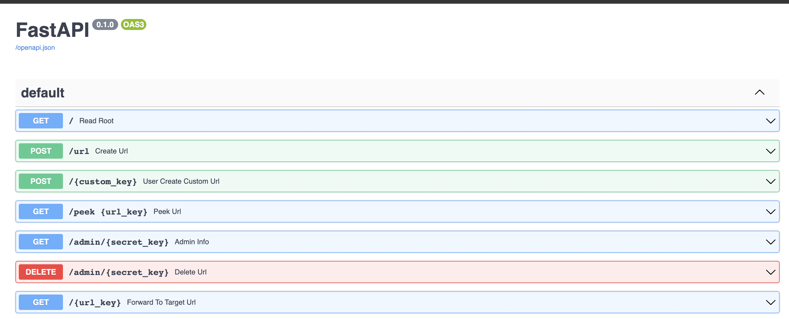

# URL Shortener
> An API that manages and creates shortened URLS
> Live demo [_here_](https://www.example.com). <!-- If you have the project hosted somewhere, include the link here. -->

## Table of Contents
* [General Info](#general-information)
* [Technologies Used](#technologies-used)
* [Features](#features)
* [Screenshots](#screenshots)
* [Setup](#setup)
* [Usage](#usage)
* [Project Status](#project-status)
* [Room for Improvement](#room-for-improvement)
* [Acknowledgements](#acknowledgements)
* [Contact](#contact)
<!-- * [License](#license) -->


## General Information
- It uses FAST API to leverage API endpoints and different HTTP requests, so when you post a target URL to the URL shortener app, you get a shortened URL and a secret key back. The shortened URL contains a random key that forwards to the target URL. You can use the secret key to see the shortened URL’s statistics or delete the forwarding.
- URL's are so boring and so long, don't you want something short, that doesn't clutter your screen, and something you can keep track of to use later
- The purpose is to take a long target URL as input, and return a shortened URL


## Technologies Used
----------------- -------
- anyio             3.6.2
- click             8.1.3
- decorator         5.1.1
- fastapi           0.92.0
- flask-sqlalchemy  3.0.2
- h11               0.14.0
- idna              3.4
- jsonschema        4.16.0
- pip               22.2.2
- pydantic          1.10.5
- python-dotenv     0.21.1
- setuptools        63.2.0
- sniffio           1.3.0
- SQLAlchemy        2.0.3
- starlette         0.25.0
- typing_extensions 4.5.0
- uvicorn           0.20.0
- validators        0.20.0


## Features
List the ready features here:
- Create a shortened URL
- Create a custom URL Key
- Forward to target urls using the shortened URL
- Deleting URLS from the database
- Managing who is using your URL
- Implements graceful forwarding which checks if the website exists before forwarding
- Peek URL mechanism so the user knows what URL they are being forwarded to


## Screenshots



## Setup
The project's dependiences are stored within a requirements.txt available in the repo

To run this project download it locally from the Github repo

```
cd ../url_shortener_project
pip install -r requirements.txt
uvicorn shortener_app.main:app --reload
```


## Usage
How does one go about using it?
Provide various use cases and code examples here.

`write-your-code-here`


## Project Status
Project is: _in progress_ / _complete_ / _no longer being worked on_. If you are no longer working on it, provide reasons why.


## Room for Improvement
Include areas you believe need improvement / could be improved. Also add TODOs for future development.

Room for improvement:
- Improvement to be done 1
- Improvement to be done 2

To do:
- Feature to be added 1
- Feature to be added 2


## Acknowledgements
Give credit here.
- This project was inspired by...
- This project was based on [this tutorial](https://www.example.com).
- Many thanks to...


## Contact
Created by [@flynerdpl](https://www.flynerd.pl/) - feel free to contact me!
